# Teste Técnico - Analista de Dados

Este repositório contém a solução para o teste técnico de Analista de Dados, analisando em SQL, modelagem de dados e visualização.

## 1. Ferramentas Usadas

* **Banco de Dados:** Google BigQuery
* **Visualização de Dados:** Google Looker Studio
* **Controle de Versão e repositório:** Git / GitHub

## 2. Motivação e Arquitetura

Para fins de demonstração, descrevi o schema em formato normalizado (camada Bronze) e criei uma modelagem dimensional (camada Gold) para fins analíticos. Esta abordagem aplica o conceito de arquitetura medalhão, criando uma cópia do banco de origem e aplicando tratamentos e cruzamentos de dados em camadas até o cliente analítico final (Dashboards, analistas, etc.).

### Motivos para uso do Google BigQuery:

* Banco de dados colunar, otimizado para propósitos analíticos (OLAP).
* Solução *Serverless*, eliminando a necessidade de gerenciamento de infraestrutura.
* Processamento paralelo massivo (MPP) para alta performance em grandes volumes.
* Integração nativa com o Looker Studio, incluindo cache de consultas e controle de parâmetros.
    * Cache automatico, funções nativas e parametros de consulta.

## 3. Como Executar os Scripts

Os scripts devem ser executados no **Google BigQuery**.

#### Diagrama do Schema transacional inicial proposto:

```mermaid
erDiagram
    %% ---- Legenda ----
    %% PK 🗝️ = Primary Key
    %% FK 🔑 = Foreign Key
    
    customers {
        INT customer_id "PK 🗝️"
        VARCHAR(100) name
        VARCHAR(100) email
        VARCHAR(100) city
        DATE created_at
    }

    products {
        INT product_id "PK 🗝️"
        VARCHAR(100) name
        VARCHAR(100) category
        DECIMAL(10_2) price
    }

    orders {
        INT order_id "PK 🗝️"
        INT customer_id "FK 🔑"
        INT product_id "FK 🔑"
        INT quantity
        DATE order_date
    }

    %% ---- Relacionamentos (1-para-Muitos) ----
    customers ||--o{ orders : "realiza"
    products  ||--o{ orders : "contém"
```

#### Diagrama do Schema analitico Final proposto:

```mermaid
erDiagram
    %% ---- Legenda ----
    %% PK 🗝️ = Primary Key (Chave Primária)
    %% FK 🔑 = Foreign Key (Chave Estrangeira)
    %% BK 🆔 = Business Key (Chave de Negócio)
    %% DD 🧾 = Degenerate Dimension (Dimensão Degenerada)
    
    %% ---- Tabela Fato (Centro) ----
    gold_FactSales {
        INT64 date_key "FK 🔑"
        INT64 customer_key "FK 🔑"
        INT64 product_key "FK 🔑"
        INT64 order_id "DD 🧾"
        INT64 quantity_sold
        NUMERIC total_revenue
    }

    %% ---- Dimensões (Estrelas) ----
    gold_DimCustomer {
        INT64 customer_key "PK 🗝️"
        INT64 customer_id "BK 🆔"
        STRING name
        STRING city
        DATE last_order_date
    }

    gold_DimProduct {
        INT64 product_key "PK 🗝️"
        INT64 product_id "BK 🆔"
        STRING name
        STRING category
        NUMERIC current_price
    }

    gold_DimDate {
        INT64 date_key "PK 🗝️"
        DATE full_date
        STRING year_month
        INT64 year
        INT64 month
    }

    %% ---- Relacionamentos (1-para-Muitos) ----
    gold_DimCustomer ||--o{ gold_FactSales : "tem"
    gold_DimProduct  ||--o{ gold_FactSales : "tem"
    gold_DimDate     ||--o{ gold_FactSales : "ocorre em"
```

### Pré-requisitos

1.  Crie um projeto no Google Cloud.
2.  Dentro do projeto, crie dois *datasets* no BigQuery (ex: `case_bronze` e `case_gold`).

### Passo 1: Criação e Simulação de Dados (Camada Bronze)

Execute o script abaixo no editor de consultas do BigQuery para criar as tabelas normalizadas e simular os dados de clientes, produtos e pedidos.

* **Script:** `querys/bd - bronze.sql`

Dessa forma será criado o schema sugerido para o case e populado dados nas tabelas.

### Passo 2: ETL para Modelo Dimensional (Camada Gold)

Execute este script para criar o Data Mart (modelo dimensional estrela) e carregar os dados tratados da camada bronze.

 * **Script:** `querys/bd - gold.sql`

Concluindo o cenário de banco de dadso que será analisado nesse caso de estudo.

### Passo 3: Consultas Analíticas (Respostas do Teste)

Após a criação das camadas bronze e gold, as consultas analíticas (itens 1 a 6) podem ser executadas. Todas elas leem dados da camada gold.

  * **Scripts:**
      * `querys/1 - Top clientes.sql`
      * `querys/2 - Vendas por categoria.sql`
      * `querys/3 - Média de ticket por cidade.sql`
      * `querys/4 - Evolução das vendas.sql`
      * `querys/5 - Produto com maior crescimento.sql`
      * `querys/6 - Clientes inativos.sql`

#### Principais Decisões, Trade-offs e Limitações

  * **Decisão (Arquitetura):** Adotar a modelagem dimensional na camada gold.
    * **Trade-off:** Esta abordagem gera redundância de dados (comparada à 3FN da camada bronze), mas oferece performance superiores para consultas analíticas.
  * **Decisão (Carga de Dados):** O script `bd - gold.sql` realiza uma carga completa (full-load).
      * **Limitação:** Para um ambiente de produção, o ideal seria implementar cargas incrementais, especialmente para a `FactSales`, carregando somente pedidos novos.
  * **Limitação (Simulação de Dados):** Os dados gerados em `bd - bronze.sql` são aleatórios.
      * **Impacto:** A distribuição de vendas, tendencias não refletemrealidade, o que limita da análise.

  * **Decisão (Query 5 - Crescimento):** A métrica de crescimento escolhida foi o maior **crescimento absoluto** na quantidade vendida comparando um mês com o mês anterior (`LAG`).
      * **Limitação:** Esse calculo favorece produtos com alto volume de vendas. Outro método é calulo usando crescimento percentual, mas é volátil para produtos com baixo volume. Outra aborgadem seria comprar o produto com benchmark da sua categoria.

## 4. Instruções para Abrir o Dashboard

O dashboard foi desenvolvido no Looker Studio e está disponível publicamente para visualização.

* Link de Acesso: [https://lookerstudio.google.com/s/sTh2xAmhmyE](https://lookerstudio.google.com/s/sTh2xAmhmyE)

O dashboard se conecta diretamente ao dataset gold no BigQuery e utiliza os requisitos mínimos solicitados no teste (KPIs, gráficos de barra, linha, pizza e filtros interativos).

### Usabilidade & Narrativa:
O dashboard demonstra os resultados comerciais da empresa, exibindo R$ 912 milhões em receita. O ticket médio de R$ 9.100 é um destaque claro para o negócio, indicando itens de alto custo. Analisando a série temporal, o faturamento mensal tende à estabilidade, mesmo com flutuações, sendo interessante para o planejamento de estoque e fluxo de caixa.

Comparando o perfil de faturamento entre categorias, é notável a diferença de receita entre Eletrônicos e Alimentos, com diferenças próximas a 70 vezes. O mesmo ocorre com os tickets médios (Eletrônicos com R$ 28.000 e Alimentos com R$ 404,81), sugerindo marketing e perfis de clientes distintos.

Dois destaques: a categoria 'Eletrônicos' compreende 60% de toda a receita e a forte presença nas cidades de São Paulo (40,5%) e Rio de Janeiro (25,3%). Esses destaques também representam pontos de atenção quanto à concentração de categoria e cidades, sendo saudável uma maior variação geográfica e de categorias. 